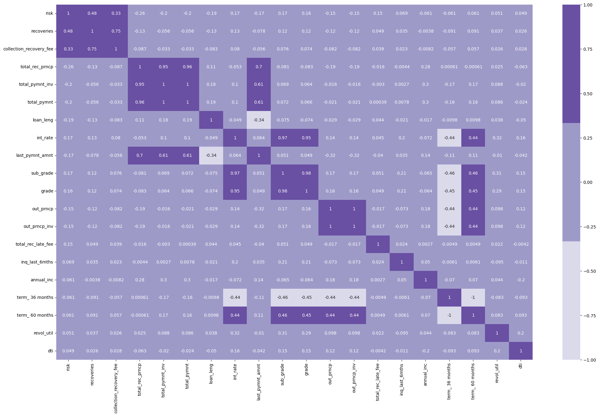

# **CREDIT RISK PREDICTION USING MACHINE LEARNING ALGORITHM**
Menurut OJK, risiko kredit adalah risiko akibat kegagalan debitur dan/atau pihak lain dalam memenuhi kewajiban kepada Bank. Dengan memprediksi risiko kredit, perusahaan dapat mengantisipasi atau mengurangi risiko kegagalan pembayaran kredit oleh peminjam. Seiring dengan perkembangan teknologi, saat ini *machine learning* banyak digunakan untuk memprediksi risiko kredit.

## **1. BUSINESS UNDERSTANDING**
**Tujuan**
- Memperoleh fitur yang paling memengaruhi risiko kredit.
- Memprediksi risiko kredit peminjam berdasarkan dataset dengan akurasi >95.00%.
**Objektif**
- Menganalisis data histori dan hubungan antar fitur untuk mendapat pola risiko kredit.
- Membuat model klasifikasi machine learning agar hasil prediksi akurat dan presisi.

## **2. DATA UNDERSTANDING**
- Dataset yang digunakan berasal dari perusahaan ID/X partners.
- Dataset terdiri dari 75 kolom dan 466.285 baris, bertipe: float64, int64, dan object.
- Kolom yang memiliki 70% nilai kosong dihapus.
- Kolom yang memiliki 1 nilai unik dihapus.
- Kolom **risk** adalah kolom target yang dibuat berdasarkan kolom **loan_status**

- **Low risk**: kredit berisiko rendah, terdiri dari nilai "Fully paid", "Current", "In Grace Period", dan "Does not meet the credit policy. Status:Fully Paid"
- **High risk** : kredit berisiko tinggi,"Charged Off", "Does not meet the credit policy. Status:Charged Off", "Default", "Late (16-30 days)", dan "Late (31-120 days)”

## **3. EXPLORATORY DATA ANALYSIS**

Mayoritas (89%) dataset adalah kredit berisiko rendah.

### **3.1 Analisis univariat**

- Kolom **funded_amnt**, **total_pymnt**, **loan_amnt**, **total_acc**, dan **dti** lebih condong ke kanan.
- **Pendapatan** peminjam (berdasarkan kolom **annual_inc**) mayoritas berada **di bawah 1.000.000**

- Rumah peminjam kebanyakan adalah KPR (MORTRAGE).
- Kelas paling banyak adalah B.
- Termin paling banyak adalah 36 bulan.
- Peminjam kebanyakan sudah memiliki rencana pembayaran dan status peminjam telah diverifikasi.
- Kebanyakan tujuan peminjam adalah membayar utang.

### **3.2 Analisis bivariat**

- Peminjam yang **tidak memiliki status kepemilikan rumah (OTHER atau NONE)** memiliki **risiko lebih tinggi** jika kredit pinjaman disetujui.
- Semakin **tinggi kelas**, tingkat **risiko pinjaman meningkat**. Kelas G lebih tinggi tingkatnya dari A.
- Pinjaman berjangka **60 bulan berisiko lebih tinggi**.
- **Status verifikasi** pada risiko pinjaman/kredit tinggi dan rendah **hampir sama**.
- **Rencana peminjaman** yang telah **dilaksanakan (y)** ternyata lebih banyak **berisiko tinggi**.
- Tujuan dari **peminjaman yang berisiko tinggi** kebanyakan adalah untuk **pendidikan dan bisnis kecil (UMKM)**

- Pembayaran kredit yang diterima bulan lalu paling banyak berasal dari peminjam dengan kepemilikan rumah **MORTGAGE**.
- Kelas **G** menyumbang pembayaran kredit yang diterima bulan lalu **paling banyak** dan kelas **B** menyumbang **paling sedikit**.
- Kredit berjangka waktu **60 bulan** **paling banyak menyumbang** pembayaran kredit yang diterima bulan lalu.
- Pembayaran kredit yang diterima bulan lalu kebanyakan **telah diverifikasi**.
- Pembayaran kredit yang diterima bulan lalu kebanyakan**telah memiliki rencana pembayaran**.
- Kredit yang diterima bulan lalu kebanyakan berasal dari pinjaman untuk **bisnis kecil**.

## **4. Data Preparation**
### **4.1 Handling Missing Values**
- Kolom yang memiliki >10% nilai kosong dihapus.
- Kolom bertipe numerik diisi dengan nilai median.
- Kolom bertipe kategori diisi dengan nilai modus.
- Terisa 40 kolom dengan tipe data: float64(23), int64(3), object(14).
### **4.2 Duplicated Data**
- Tidak terdapat data yang terduplikat.
### **4.3 Feature Engineering**
Untuk melihat bagaimana histori dari tiap peminjam, akan dibuat kolom baru:
- **loan_leng** : durasi utang sejak bulan didanainya pinjaman sampai bulan peminjam membayar utang.
- **loan_age**: umur pinjaman terakhir untuk melihat durasi peminjam berutang sejak bulan saat pinjaman didanai sampai terakhir kredit ditarik.
- **credit_duration**: durasi kredit disetujui sejak tanggal pembukaan batas kredit paling awal sampai bulan saat pinjaman didanai.
### **4.4 Handling Outlier**
- Digunakan metode Isolation Forest untuk mendeteksi anomali/outlier. Keunggulan dari metode ini adalah cocok untuk data multi dimensional dan data yang tidak berdistribusi normal.
- Terdapat 6013 nilai outlier yang dihapus karena jumlahnya relatif sangat sedikit.
### **4.5 Feature Selection**
- Dilakukan feature encoding pada kolom kategori.
- Dilakukan juga one-hot encoding pada kolom term, home_ownership, verification_status, dan purpose.

- Dilakukan seleksi fitur berdasarkan korelasi Pearson terhadap kolom target (risk) 20 fitur teratas.
- 5 fitur teratas yang berkorelasi tinggi terhadap risk adalah fitur recoveries, collection_recovery_fee, total_rec_prncp, total_pymnt_inv, dan total_pymnt.

Beberapa kolom numerik memiliki korelasi sangat tinggi (>0.7). Kolom tersebut dihapus untuk memfokuskan analisis.
- Diantara kolom total_pymnt_inv, total_pymnt, dan total_rec_prncp, kita akan gunakan kolom total_pymnt karena menunjukkan jumlah dana pinjaman yang diterima dari peminjam.
- Kemudian, diantara kolom grade, sub_grade, dan int_rate kita pertahankan kolom grade karena menunjukkan kelas/tingkat pinjaman.
- Lalu, diantara kolom out_prncp dan out_prncp_inv, kita pilih kolom out_prncp yang menunjukkan sisa pokok terutang dari jumlah pokok yang didanai.
- Terakhir, diantara kolom recoveries dan collection_recovery_fee, kita pilih kolom recoveries yang menunjukkan apakah peminjam telah memiliki rencana pembayaran.

### **4.6 Data Split**
- Digunakan train-test set dengan proposi 80:20. Train set digunakan untuk melatih data pada algoritma machine learning. Sementara itu, test set digunakan dalam evaluasi model machine learning.
### **4.7 Standarisasi**
- Dilakukan standarisasi pada tiap kolom menggunakan Standard Scaler.
## **5. Data Modeling and Evaluation**

  

- Random Forest kemungkinan overfit sangat tinggi sehingga model ini belum bisa menangkap pola dengan baik bila diberi data lain. Selain itu, waktu komputasinya sangat lama.
- Logistic regression memiliki akurasi yang sangat baik dan tidak overfit, hanya saja recall score sangat kecil. Artinya, banyak kategori high risk yang diprediksi sebagai low risk yang mana sangat membahayakan. Selain itu, waktu komputasinya juga lama.
- XGBoost memiliki akurasi sangat baik, tidak overfit, tetapi skor recall relatif lebih kecil dari algoritma Random Forest. Meskipun demikian, presisinya sangat baik, artinya dapat menangkap kasus low risk dengan sangat baik. Kelebihan lain dari algoritma ini adalah waktu komputasinya sangat singkat.
## **6. Conclusion**
- Fitur yang paling berkorelasi dengan risiko kredit adalah **recoveries, collection_recovery_fee, total_rec_prncp,** dan **total_pymnt**.
- Algoritma machine learning yang paling cocok untuk prediksi kredit analisis adalah **XGBoost** dengan test score akurasi 97.41%, presisi 94.53%, recall 80.39%, dan f1 86.89%.
